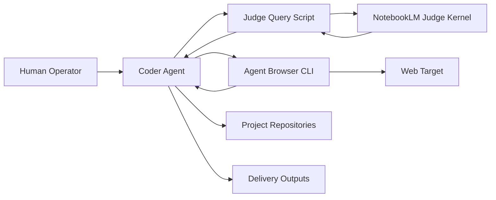
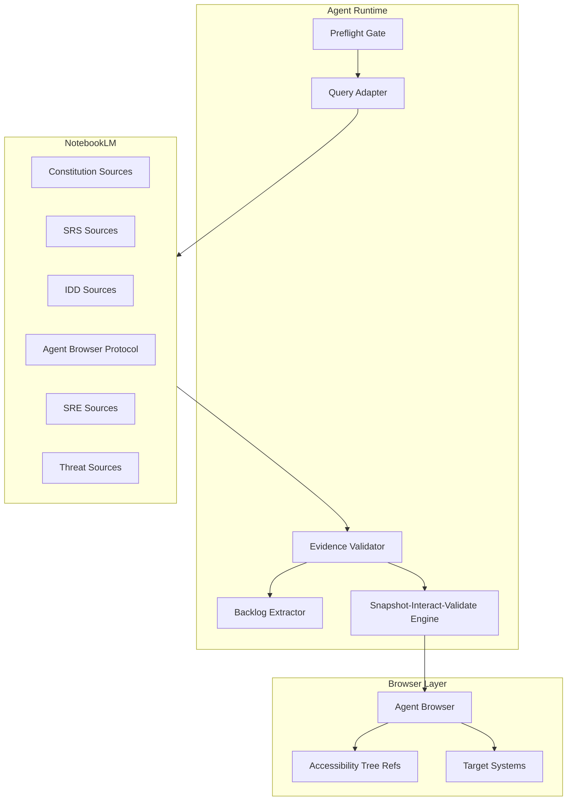

# System Overview

## C4 Level 1 - System Context

## C4 Level 2 - Container View

## Trust Boundaries
- Boundary 1: Agent runtime to external NotebookLM API.
- Boundary 2: Notebook evidence to autonomous execution decision.
- Boundary 3: Governance documents to implementation repositories.
